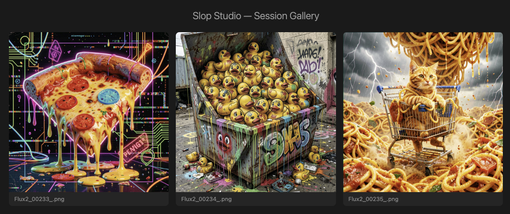

# Slop Studio

MCP server for conversational image generation via ComfyUI. Generate images through natural conversation in Claude Code — describe what you want, and slop-studio handles template selection, job submission, polling, and output.

*slop-studio powers [@generatedhorror.bsky.social](https://bsky.app/profile/generatedhorror.bsky.social), my horror-themed AI art account.*


## Features

- Conversational image generation through Claude Code and Claude Desktop
- Ships thirteen starter templates spanning local and cloud backends — Flux.2 Klein (local GGUF), Flux.2 Dev (cloud), Flux.2 Pro API (cloud), Google's Gemini 3 Pro Image / "Nano Banana Pro" (cloud), and **OpenAI GPT Image 2** (runs through your local ComfyUI via Comfy's partner-API proxy — no Comfy Cloud account subscription needed, just the API key)
- Workflow template system with browsing, customization, and aspect ratios
- Pluggable execution backends — run locally via ComfyUI or on [Comfy Cloud](https://www.comfy.org/cloud); routing is per-template
- Automatic ComfyUI spawning and lifecycle management
- Job queuing and automatic polling
- Bluesky posting built in
- Claude Desktop one-click install via a signed `.mcpb` Desktop Extension
- Centralized credential management (`slop-studio auth`) for Bluesky and Comfy Cloud
- One-command project scaffolding (`slop-studio init`)

## Prerequisites

- Python 3.11+
- [uv](https://docs.astral.sh/uv/) package manager
- ComfyUI running and accessible over HTTP (default: `http://localhost:8188`)

## Install

```bash
uv tool install git+https://github.com/Sathias23/slop-studio.git
```

This puts the `slop-studio` command on your PATH.

### Install from source

```bash
git clone https://github.com/Sathias23/slop-studio.git
cd slop-studio
uv tool install -e .
```

This installs `slop-studio` on your PATH from your local clone. Changes you make to the source take effect immediately.

## Quick Start

1. **Start ComfyUI** on your local machine or network (or [set up automatic launch](#automatic-comfyui-management)).

2. **Set up a project directory:**

   ```bash
   mkdir my-art && cd my-art
   slop-studio init
   ```

   This scaffolds the directory with starter templates, `.mcp.json` (MCP server config for Claude Code), a `/generate` slash command, and a `CLAUDE.md`.

3. **Open Claude Code** in the project directory and start creating. Use the `/generate` slash command or just ask Claude to make an image:

   ```
   /generate a sunset over mountains, cinematic lighting
   ```

   ```
   make me a horror-themed portrait of a haunted lighthouse
   ```

## Claude Desktop

slop-studio also works with the Claude Desktop app. Desktop uses a global config file instead of per-project `.mcp.json`.

### One-Click Install

Build the Desktop Extension package locally:

```bash
slop-studio build-mcpb
```

This creates a `slop-studio-*.mcpb` file in the current directory. Double-click it and Claude Desktop will prompt you for:

- **ComfyUI URL** — defaults to `http://localhost:8188`
- **ComfyUI Start Command** — leave blank if ComfyUI is already running, or enter the full command (e.g., `python /path/to/ComfyUI/main.py --port 8188`)
- **Output Directory** — where generated images are saved (defaults to `~/slop-studio/output`)

That's it — restart Claude Desktop and slop-studio tools are ready to use.

**Prerequisites for manual methods below:** Python 3.11+, ComfyUI installed, and `slop-studio` installed via `uv tool install git+https://github.com/Sathias23/slop-studio.git`.

### Automatic Setup

Generate the config snippet with auto-detected paths:

```bash
slop-studio desktop-config
```

Use `--copy` to copy it directly to your clipboard:

```bash
slop-studio desktop-config --copy
```

### Manual Setup

Add slop-studio to your `claude_desktop_config.json`. Open it from Claude Desktop via **Settings → Developer → Edit Config**, then add:

```json
{
  "mcpServers": {
    "slop-studio": {
      "command": "/path/to/slop-studio",
      "args": ["serve"],
      "env": {
        "COMFYUI_URL": "http://localhost:8188",
        "COMFYUI_START_CMD": "python /path/to/ComfyUI/main.py --port 8188",
        "SLOP_STUDIO_OUTPUT_DIR": "~/slop-studio/output"
      }
    }
  }
}
```

Replace `/path/to/slop-studio` with the output of `which slop-studio`. Replace the ComfyUI path with your actual installation.

**Environment variables:**

| Variable | Description |
|----------|-------------|
| `COMFYUI_URL` | ComfyUI server address (default: `http://localhost:8188`) |
| `COMFYUI_START_CMD` | Full command to launch ComfyUI. slop-studio will start/stop it automatically. |
| `SLOP_STUDIO_OUTPUT_DIR` | Where generated images are saved. Use an absolute path — Desktop doesn't have a project directory. |

### Code vs Desktop

| | Claude Code | Claude Desktop |
|---|---|---|
| Config file | `.mcp.json` (per-project) | `claude_desktop_config.json` (global) |
| Templates | Per-project `templates/` dir | Package-bundled defaults |
| Output | Per-project `output/` dir | `~/slop-studio/output` |
| Env vars | `.env` file or env block | `env` block in config only |
| Setup | `slop-studio init` | `slop-studio desktop-config` |

### Desktop Troubleshooting

**Tools don't appear after restart:** Verify the `command` path points to the actual `slop-studio` binary (run `which slop-studio` to check). Claude Desktop doesn't use your shell profile, so `uv` and other tools may not be on its PATH.

**ComfyUI not found:** Set `COMFYUI_START_CMD` to the full path to your ComfyUI's `main.py` with the Python executable. Use the absolute path — no `~` expansion.

**Images saved to wrong location:** Set `SLOP_STUDIO_OUTPUT_DIR` to an absolute path (e.g., `/Users/you/slop-studio/output`). Desktop doesn't have a project directory, so relative paths won't work.

## Credentials

`slop-studio auth` configures Bluesky and/or Comfy Cloud credentials and stores them in `~/.config/slop-studio/credentials.json` (mode 0600). The MCP server picks them up automatically — no per-project configuration needed.

```bash
slop-studio auth                 # interactive: prompts [b]luesky / [c]omfy-cloud / [a]ll
slop-studio auth --bluesky       # just Bluesky
slop-studio auth --comfy-cloud   # just Comfy Cloud
slop-studio auth --all           # both
```

Running `auth` **merges** into the existing file — configuring one service never clobbers the other. Existing entries for the selected service prompt a per-service overwrite confirmation.

- Create a Bluesky app password at [bsky.app](https://bsky.app) > Settings > App Passwords.
- Create a Comfy Cloud API key at [platform.comfy.org/profile/api-keys](https://platform.comfy.org/profile/api-keys) (shown once — copy it immediately). The same key is used for both Comfy Cloud submissions AND any **local** workflow that includes a Comfy partner-API node (OpenAI GPT Image 2, Flux 2 Pro, Gemini / Nano Banana, etc.) — the node proxies upstream through Comfy's account-API infrastructure even when ComfyUI itself runs locally.

## CLI

```
slop-studio auth            Configure Bluesky and/or Comfy Cloud credentials
slop-studio init            Scaffold an art project directory
slop-studio serve           Launch the MCP server (used by .mcp.json)
slop-studio desktop-config  Generate Claude Desktop config snippet
slop-studio build-mcpb      Build .mcpb Desktop Extension package
```

## MCP Tools

| Tool | Description |
|------|-------------|
| `list_templates` | Browse available workflow templates |
| `get_template` | Inspect inputs and aspect ratios for a template |
| `queue_prompt` | Submit a generation job |
| `check_next_job` | Poll multiple jobs for completion |
| `get_image` | Retrieve the output image path with inline thumbnail |
| `open_gallery` | Open image(s) — single opens in OS viewer, multiple opens HTML gallery |
| `open_comfy_cloud_portal` | Open the Comfy Cloud billing/account portal in the default browser |
| `post_to_bluesky` | Post image(s) to Bluesky with text and hashtags |
| `add_template` | Register a new ComfyUI workflow |
| `update_template` | Update an existing template |
| `delete_template` | Remove a template |

## Comfy Cloud

slop-studio can route generation to [Comfy Cloud](https://www.comfy.org/cloud) instead of a local ComfyUI. Cloud submissions use the same workflow JSON, the same template files, and the same MCP tools — only routing differs.

### Get an API key

Visit [platform.comfy.org/profile/api-keys](https://platform.comfy.org/profile/api-keys) and generate a key. Keys are shown **once** — copy it immediately. An active paid subscription is required to run workflows.

### Configure the key

**Option A — environment variable (recommended):**

For **Claude Code**, add to your project's `.env`:

```
COMFY_CLOUD_API_KEY=comfy_xxxxxxxxxxxx
```

For **Claude Desktop**, add to the `env` block in `claude_desktop_config.json`:

```json
{
  "mcpServers": {
    "slop-studio": {
      "env": {
        "COMFY_CLOUD_API_KEY": "comfy_xxxxxxxxxxxx"
      }
    }
  }
}
```

**Option B — central credentials file:**

Run `slop-studio auth --comfy-cloud` (or `--all` to configure Bluesky at the same time) and paste the key when prompted. The value lands in `~/.config/slop-studio/credentials.json`:

```json
{
  "bluesky": { "handle": "...", "app_password": "..." },
  "comfy_cloud": { "api_key": "comfy_xxxxxxxxxxxx" }
}
```

`auth` merges into the file, so configuring Comfy Cloud never overwrites your Bluesky block (and vice-versa).

When both the env var and `credentials.json` are set, the env var wins.

### Route submissions to cloud

Two levers, evaluated in order:

1. **Per-template:** set `"backend": "cloud"` in a template's `.meta.json`. That template always routes to cloud. Tag with `"backend": "local"` to lock to local, or `"backend": "either"` to defer to the default.
2. **Global default:** set `SLOP_STUDIO_DEFAULT_BACKEND=cloud` to route every `"either"`-tagged or unlabelled template through cloud.

### Worked example

Every `api_*` template and `image_flux2*` variant ships pre-tagged with `"backend": "cloud"`, so once your key is configured there's nothing else to do:

```bash
# In your project's .env
echo "COMFY_CLOUD_API_KEY=comfy_xxxxxxxxxxxx" >> .env
```

Then, from Claude Code:

```
/generate edit this photo to add a pale yellow knitted beanie with a white patch reading FLUX.2 COMFY
```

Claude picks the cloud-tagged `image_flux2` template, calls `queue_prompt`, and the router forwards to Comfy Cloud because of the template's `backend` field. Nano Banana Pro and Flux.2 Pro templates behave the same way.

### When things go wrong

Four cloud-specific error codes may come back from `queue_prompt`:

| Error | What it means | What to do |
|-------|---------------|------------|
| `auth_failed` | API key missing, invalid, or unregistered | Check `COMFY_CLOUD_API_KEY`; regenerate at the portal |
| `no_credits` | Account has 0 credits for this run | Call `open_comfy_cloud_portal` to top up |
| `account_issue` | Billing, subscription, or account problem | Call `open_comfy_cloud_portal` to resolve |
| `rate_limited` | Exceeded the plan tier's concurrent-job cap | Wait and retry; plan tiers: Free/Standard=1, Creator=3, Pro=5 |

The `open_comfy_cloud_portal` MCP tool opens `https://platform.comfy.org/` in your default browser — no auth, no config, just a shortcut so Claude can offer "click here to fix" in the conversation.

See [docs/comfy-cloud-integration.md](docs/comfy-cloud-integration.md) for the architectural overview.

## Templates

Workflow templates live in `templates/` as `.json` + `.meta.json` pairs. Thirteen starter templates ship with every project, spanning both backends:

**Local — GGUF models on your GPU (Flux.2 Klein, 16 GB VRAM):**

- **flux2_klein** — fast single-pass generation (~30s), 9 aspect ratios
- **flux2_klein_ultrawide** — 3440x1440 wallpapers with 4x upscale (~60s)
- **flux2_klein_edit** — multi-reference image editing with style/content transfer (~60s)

**Local — partner-API nodes (requires `COMFY_CLOUD_API_KEY`; no VRAM used, node proxies upstream):**

- **api_openai_gpt_image_2_t2i** — OpenAI GPT Image 2 text-to-image; 10 aspect ratios
- **api_openai_gpt_image_2_image_edit** — OpenAI GPT Image 2 single-reference edit; 10 aspect ratios

**Cloud (Comfy Cloud; requires `COMFY_CLOUD_API_KEY`):**

- **image_flux2** — Flux.2 Dev single-reference image edit
- **image_flux2_text_to_image** — Flux.2 Dev text-to-image
- **api_flux2_pro_1img / _2img / _4img** — Flux.2 Pro API (Black Forest Labs), one / two / four reference images; 7 aspect ratios each
- **api_nano_banana_pro_text_to_image / _1img / _2img** — Google Gemini 3 Pro Image ("Nano Banana Pro"); 10 aspect ratios each

Cloud templates don't touch local VRAM — the partner-API nodes run upstream at BFL and Google. The GPT Image 2 variants are tagged `backend: "local"` (submissions go through your local ComfyUI) but the actual generation happens at OpenAI via Comfy's partner-API proxy — your GPU stays idle. Comfy Cloud doesn't yet ship the gpt-image-2 model, so local-routed is the only option today. Add your own by exporting a workflow from ComfyUI's browser UI and calling `add_template`.

## Configuration

| Environment Variable | Default | Description |
|---------------------|---------|-------------|
| `COMFYUI_URL` | `http://localhost:8188` | ComfyUI server address |
| `COMFYUI_START_CMD` | — | Command to launch ComfyUI (e.g. `python /path/to/ComfyUI/main.py --port 8188`). When set, slop-studio starts and stops ComfyUI automatically. |
| `COMFYUI_START_TIMEOUT` | `120` | Seconds to wait for ComfyUI to become ready after launch |
| `SLOP_STUDIO_TEMPLATES_DIR` | `./templates` | Template directory |
| `SLOP_STUDIO_OUTPUT_DIR` | `~/slop-studio/output` | Output directory |
| `COMFY_CLOUD_API_KEY` | — | Comfy Cloud API key. Overrides `credentials.json`. Get one at [platform.comfy.org/profile/api-keys](https://platform.comfy.org/profile/api-keys). |
| `COMFY_CLOUD_URL` | `https://cloud.comfy.org` | Comfy Cloud API base URL. Only override for testing or a self-hosted mirror. |
| `SLOP_STUDIO_DEFAULT_BACKEND` | `local` | Routes `queue_prompt` submissions when a template doesn't declare its own `backend`. `"local"` or `"cloud"`. |
| `BSKY_HANDLE` | — | Bluesky handle (overrides central config) |
| `BSKY_APP_PASSWORD` | — | Bluesky app password (overrides central config) |

Environment variables take precedence over `slop-studio auth` credentials. A project-level `.env` file is also supported.

## Automatic ComfyUI Management

By default, slop-studio expects ComfyUI to already be running. Set `COMFYUI_START_CMD` in your project's `.env` to have slop-studio manage ComfyUI's lifecycle automatically:

```
COMFYUI_START_CMD=/path/to/venv/bin/python /path/to/ComfyUI/main.py
```

**How it works:**

- **On startup:** slop-studio checks if ComfyUI is already reachable. If it is, it connects to the existing instance. If not, it launches ComfyUI as a child process and polls until it's ready (up to `COMFYUI_START_TIMEOUT` seconds).
- **On shutdown:** When you exit Claude Code or restart the MCP server, slop-studio sends SIGTERM to ComfyUI and waits for a clean exit. If ComfyUI doesn't stop within 10 seconds, it's forcefully killed.
- **Already running:** If ComfyUI is already running when slop-studio starts, it skips the launch and connects to the existing instance. It won't shut down an instance it didn't start.

> **Note:** Point `COMFYUI_START_CMD` at Python directly (not the `comfy` CLI), so slop-studio can manage the process lifecycle cleanly.

## Image Viewing

slop-studio can open generated images directly from the conversation.

- **`open_gallery`** accepts a single image path or a list. One image opens directly in the OS default viewer (Preview on macOS, etc.). Multiple images generate a lightweight HTML page with a dark grid layout and lightbox, then open it in your browser — useful for comparing generations side by side.

Image paths are validated against an allowlist of extensions (`.png`, `.jpg`, `.jpeg`, `.gif`, `.webp`, `.bmp`, `.tiff`) and must reside inside the configured output directory.



## Key Files

If you're reviewing the code before installing — here are the important files:

| File | What it does |
|------|-------------|
| [`slop_studio/server.py`](slop_studio/server.py) | MCP tool definitions — all tool handlers including `open_gallery` |
| [`slop_studio/backends/router.py`](slop_studio/backends/router.py) | Dispatches each submission to the right backend, partitions `check_next_job` batches by backend, and re-prefixes prompt_ids on egress |
| [`slop_studio/backends/local.py`](slop_studio/backends/local.py) | Local ComfyUI HTTP client — job submission, polling, image retrieval, input injection |
| [`slop_studio/backends/cloud.py`](slop_studio/backends/cloud.py) | Comfy Cloud REST client — auth-stripping on signed-URL redirects, error taxonomy, partner-API-node key forwarding |
| [`slop_studio/templates.py`](slop_studio/templates.py) | Template CRUD + meta validation |
| [`slop_studio/process.py`](slop_studio/process.py) | Cross-platform process management — start/stop/cleanup of ComfyUI |
| [`slop_studio/config.py`](slop_studio/config.py) | Configuration resolution — env vars, config.toml, defaults |
| [`slop_studio/gallery.py`](slop_studio/gallery.py) | HTML gallery generator |
| [`slop_studio/mcpb.py`](slop_studio/mcpb.py) | MCPB Desktop Extension builder |
| [`manifest.json`](manifest.json) | Desktop Extension manifest — declares tools, user config, and server entry point |

## Coming Soon

- More workflow templates (SDXL, video, inpainting, LoRA stacks)
- Model downloading and management tools
- The Sloppifier — token and prompt manipulation tools
- Claude Code personas and lore system
- ComfyUI auto-restart on mid-session crash

## Troubleshooting

**ComfyUI not starting automatically:** slop-studio will launch ComfyUI for you when `COMFYUI_START_CMD` is configured, but this isn't bulletproof on every setup. If you run into issues, start ComfyUI manually before opening Claude Code or Claude Desktop — slop-studio will detect the running instance and connect to it.

## Development

```bash
git clone https://github.com/Sathias23/slop-studio.git
cd slop-studio
uv sync
uv run python -m pytest
```
